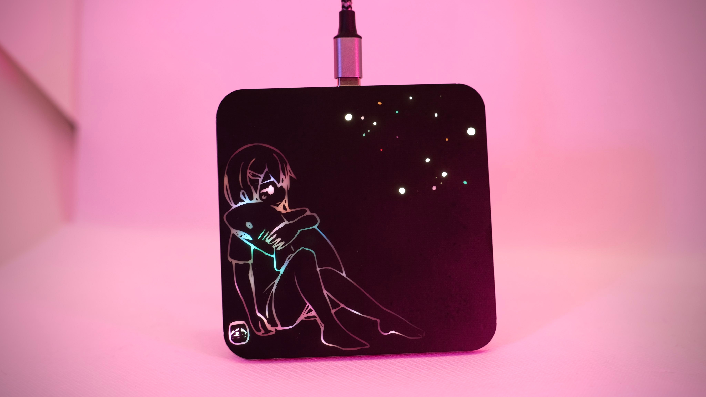
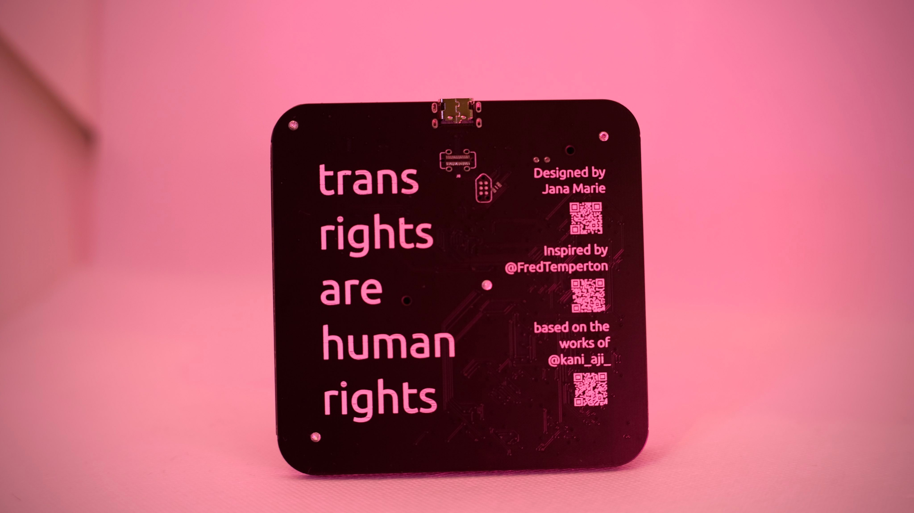
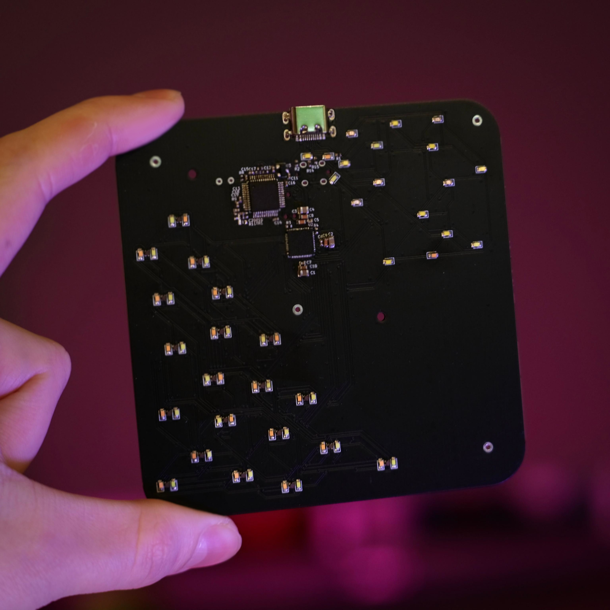
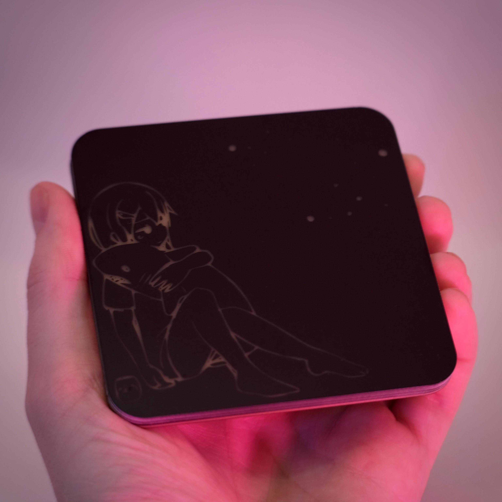

# haj-coaster

A sharky and colourful coaster glowing in pride for you~.

It consists of a stack of three circuit boards, sandwhiched together. There is a STM32F072, a LED driver and plenty LEDs on the baseboard, cutouts on the midboards to hide the components in, and a mask frontboard that shows the artwork. The LEDs are not all simple RGB ones, but a set of single color LEDs for the stars, carefully selected to represent the diversity in color on a night sky. For the girl on the left side, each LED spot consists of 5 single LEDs, RGB + Pink + Cyan, allowing one to expand the typical RGB range with opically pleasant cyan tones (for the shark and drink) and pink tones (e.g. for the skin, shark and drink).
There is also a NTC within the stack, I intended to change the sharks colour from cyan to pink following the coasters temperature. A warm drink would tint the shark pink, a cold one cyan. However, I never dared to place a drink on it, it's just to cute to hide it behind some glass or mug 🥺

<table>
  <tbody>
    <tr>
      <td colspan="2">
        
      </td>
    </tr>
    <tr>
      <td>
        
      </td>
      <td>
        
      </td>
    </tr>
    <tr>
      <td colspan="2">
        
      </td>
    </tr>
    <tr>
      <td>
        
      </td>
      <td>
        
      </td>
    </tr>
    <tr>
      <td colspan="2">
        
      </td>
    </tr>
  </tbody>
</table>

---

Thank you [かにあじ](https://void-aquarium.com/) for allowing me to use your fantastic artwork for this project! ありがとうございます!
!
